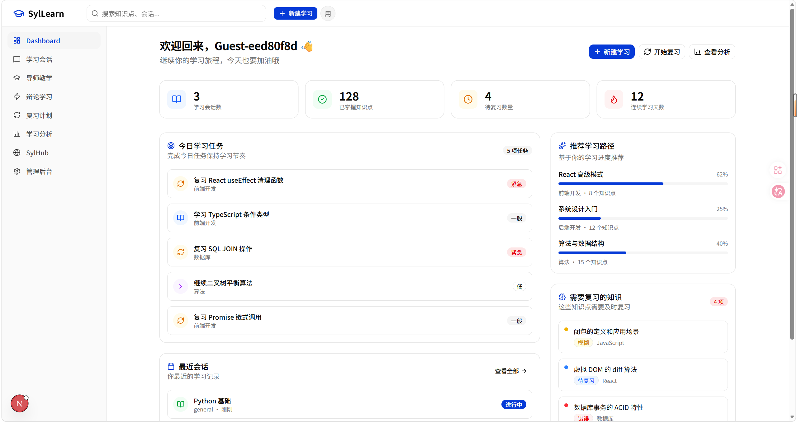
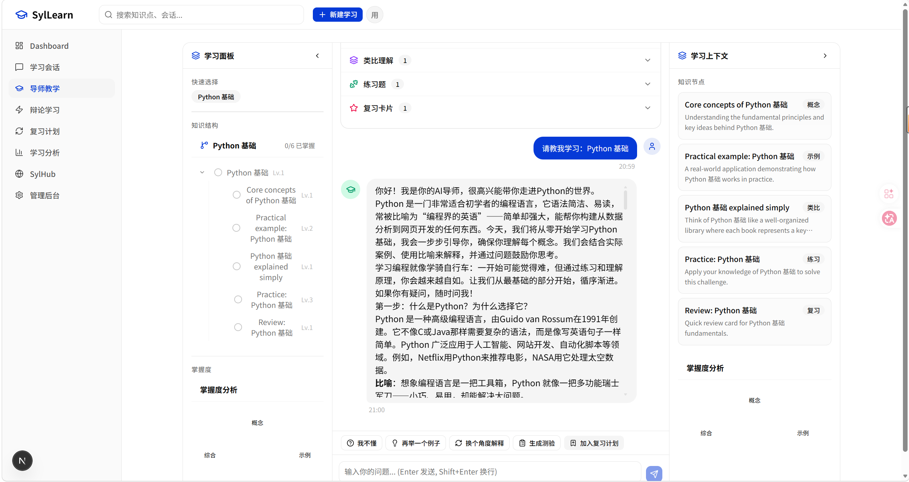
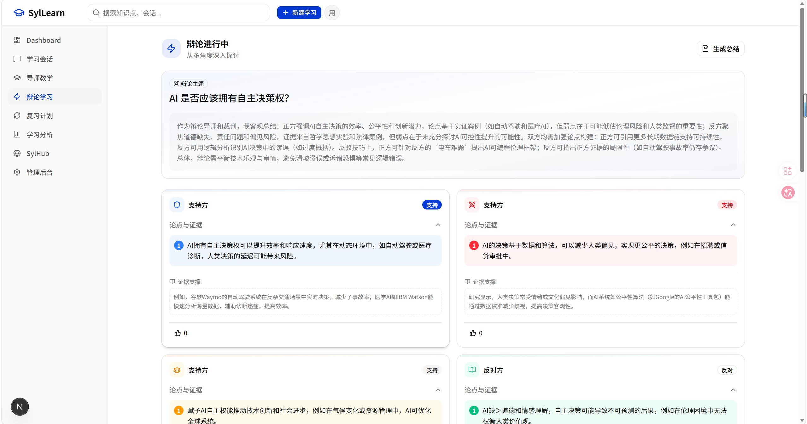
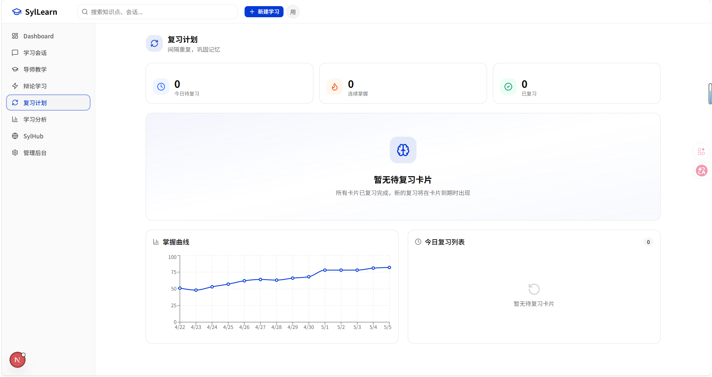
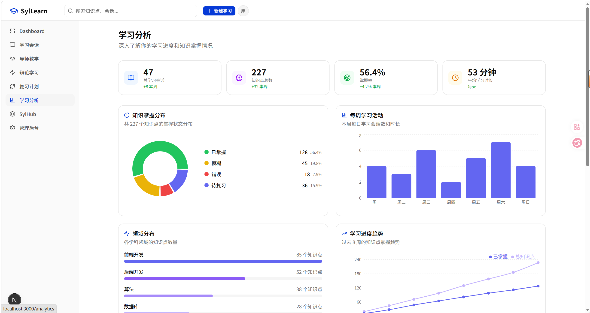
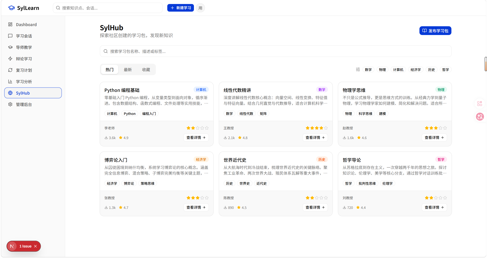
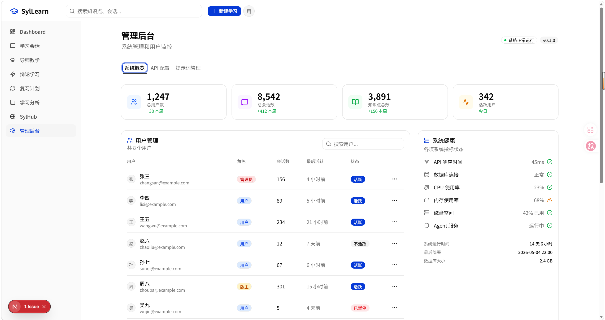

# SylLearn - Agent-Native 教育平台

> 用 AI 智能体重新定义学习。不是聊天工具，而是知识编译引擎。

SylLearn 是一个开源、永久免费、可自部署的 Agent-Native 教育平台。学习者不是简单地"看课程"，而是在与 AI 智能体协作、训练、辩论、复习的过程中完成知识学习和内化。

## 核心功能

- **知识编译引擎** - 输入一个知识点，系统自动拆解为核心概念、前置知识、常见误区、典型例题、复习卡片
- **智能导师 Agent** - 苏格拉底式提问引导，支持解释、举例、简化、挑战等多种教学模式
- **辩论式学习** - AI 自动生成正反方论点与证据，在冲突中加深理解
- **间隔重复复习** - 基于 SM-2 算法的长期记忆系统
- **学习进度分析** - 掌握度曲线、学习时间分布、知识点掌握雷达图
- **SylHub 教纲市场** - 社区贡献的优质教学资源
- **多模型支持** - 接入 OpenAI、DeepSeek、小米 MiMo 等主流 AI 模型，支持自定义端点
- **提示词管理** - 管理员可针对不同教学场景预设和调整 AI 提示词模板

## 技术栈

| 层级 | 技术 |
|------|------|
| 框架 | Next.js 16 (App Router + Turbopack) |
| 语言 | TypeScript 5 |
| 样式 | Tailwind CSS 4 + shadcn/ui (Base UI) |
| 动画 | Framer Motion |
| 图表 | Recharts |
| Markdown | react-markdown + remark-gfm |
| 数据库 | Prisma 7 + SQLite (better-sqlite3) |
| 认证 | JWT (jsonwebtoken) + bcryptjs |
| AI 适配 | OpenAI 兼容 API 适配器（支持流式/结构化输出） |

## 环境要求

- Node.js >= 20.0.0
- npm >= 10.0.0

## 快速开始

### 1. 安装依赖

```bash
npm install
```

### 2. 配置环境变量

项目根目录已有 `.env` 文件，默认配置如下：

```env
DATABASE_URL="file:./prisma/dev.db"
JWT_SECRET="syllearn-jwt-secret-2024-change-in-production"
NEXT_PUBLIC_APP_NAME="SylLearn"
NEXT_PUBLIC_APP_URL="http://localhost:3000"
```

> **生产环境部署时务必修改 `JWT_SECRET` 为随机强密码。**

### 3. 初始化数据库

```bash
npx prisma migrate dev
npx tsx prisma/seed.ts
```

种子数据会创建以下测试账号：

| 角色 | 邮箱 | 密码 |
|------|------|------|
| 管理员 | admin@syllearn.com | admin123 |
| 教师 | teacher@syllearn.com | teacher123 |
| 学生 | student@syllearn.com | password123 |

### 4. 启动开发服务器

```bash
npm run dev
```

访问 http://localhost:3000 即可使用。

### 5. 配置 AI 模型（可选）

登录管理后台 (`/admin`)，在 **API 配置** 标签页中添加 AI 模型：

1. 选择模型提供商（OpenAI / DeepSeek / 小米 MiMo / 自定义）
2. 填写 API Key 和端点地址
3. 选择模型名称
4. 点击"测试连接"验证配置
5. 启用该配置

未配置 AI 模型时，系统会自动使用内置的中文模拟响应。

## Docker 部署

```bash
docker compose up -d
```

访问 http://localhost:3000 即可使用。

容器内会自动执行数据库迁移和种子数据初始化。数据持久化通过 Docker volume `syllearn-db` 实现。

## 项目结构

```
src/
  app/
    page.tsx                      # 首页 Landing Page
    layout.tsx                    # 根布局（Geist 字体、主题 Provider）
    globals.css                   # 全局样式 + Tailwind 主题变量
    (auth)/
      login/page.tsx              # 登录页（邮箱密码 + 匿名试用）
      register/page.tsx           # 注册页
    (dashboard)/
      layout.tsx                  # Dashboard 布局（侧边栏 + Header）
      page.tsx                    # Dashboard 首页（统计概览）
      tutor/page.tsx              # 导师教学页（对话式学习）
      debate/page.tsx             # 辩论学习页（正反方论点展示）
      review/page.tsx             # 复习页（间隔重复卡片）
      analytics/page.tsx          # 学习分析（图表展示）
      sylhub/                     # SylHub 教纲市场
      admin/page.tsx              # 管理后台（统计/API配置/提示词管理）
    api/
      auth/route.ts               # 认证 API（登录/注册/匿名）
      sessions/route.ts           # 学习会话 CRUD
      agents/route.ts             # Agent 交互（教学/测验/辩论/复习）
      skills/route.ts             # 技能编译与查询
      memory/route.ts             # 记忆系统
      review/route.ts             # 复习计划
      marketplace/route.ts        # 教纲市场
      admin/
        api-config/route.ts       # AI 模型配置 CRUD
        api-config/test/route.ts  # AI 模型连接测试
        prompts/route.ts          # 提示词模板管理
  components/
    layout/                       # Header, Sidebar, Footer
    ui/                           # shadcn/ui 组件（Button, Card, Input 等）
    agent/                        # AgentAvatar, ChatBubble, DebatePanel, ChatInput
    learning/                     # SkillCard, ReviewCard
    landing/                      # 首页展示组件
    markdown/                     # Markdown 编辑器
  lib/
    agent/
      model-adapter.ts            # AI 模型适配器工厂（getModelAdapter）
      mock-adapter.ts             # Mock 适配器（无 AI 配置时的模拟响应）
      orchestrator.ts             # Agent 编排器
      base-agent.ts               # Agent 基类
    auth/jwt.ts                   # JWT 工具函数
    db/prisma.ts                  # Prisma 客户端（绝对路径 SQLite）
    utils.ts                      # cn() 等通用工具
  hooks/
    use-auth.ts                   # 认证 Hook（登录/注册/登出）
    use-session.ts                # 会话 Hook（创建/加载会话）
    use-agent.ts                  # Agent 交互 Hook（发送消息/加载历史/错误处理）
  types/
    agent.ts                      # Agent 相关类型定义
prisma/
  schema.prisma                   # 数据库 Schema（User, Session, Message, Topic, ApiConfig, PromptTemplate 等）
  seed.ts                         # 种子数据（测试账号、默认提示词模板）
  prisma.config.ts                # Prisma 配置（SQLite + 种子命令）
docker-compose.yml                # Docker Compose 配置
Dockerfile                        # 多阶段构建 Dockerfile
components.json                   # shadcn/ui 配置
```

## 运行效果

### 总面板

登录后进入 Dashboard 总览页面，展示学习统计、今日任务和复习提醒。



### 导师教学

输入学习主题后，AI 导师以苏格拉底式对话引导学习，支持解释、举例、简化、挑战等多种教学模式。AI 回答支持 Markdown 格式渲染，长文本可滚动查看。



### 辩论学习

输入辩论话题，AI 自动生成正反方论点与证据支撑，用户可从多角度深入理解争议话题。支持向各方提问和生成辩论总结。



### 复习计划

基于 SM-2 间隔重复算法的智能复习系统，根据掌握程度自动调度复习时间，越用越懂你的学习节奏。



### 学习分析

通过掌握度曲线、学习时间分布和知识点掌握雷达图，全面了解学习进度和薄弱环节。



### 学习社区

SylHub 教纲市场，浏览社区贡献的优质学习资源，支持搜索和分类筛选。



### 管理后台

管理员可在后台查看系统统计、配置 AI 模型（OpenAI / DeepSeek / MiMo 等）以及管理各场景的提示词模板。



## Agent 系统

SylLearn 内置六大 Agent 角色：

| Agent | 角色 | 说明 |
|-------|------|------|
| Planner | 学习规划师 | 规划学习路径，分析前置知识依赖 |
| Compiler | 知识编译器 | 将知识点编译为结构化 Skill |
| Tutor | 智能导师 | 苏格拉底式教学引导，支持多种教学模式 |
| Exam | 出题官 | 自动出题、判分、生成反馈 |
| Debate | 辩论主持人 | 生成正反方论点与证据 |
| Memory | 记忆管理师 | 长期记忆管理、复习调度 |

### AI 模型集成

系统通过 `getModelAdapter()` 工厂函数获取 AI 适配器，支持以下模型提供商：

- **OpenAI** - GPT-4o、GPT-4o-mini 等
- **DeepSeek** - DeepSeek-Chat、DeepSeek-Coder 等
- **小米 MiMo** - mimo-v2-flash 等
- **自定义** - 任何 OpenAI 兼容 API

未配置 AI 模型时，系统自动使用 `MockAdapter` 生成中文模拟响应，确保所有功能可用。

## 测试账号

种子数据创建了以下测试账号（密码见 `prisma/seed.ts`）：

| 角色 | 邮箱 | 密码 | 权限 |
|------|------|------|------|
| 管理员 | admin@syllearn.com | admin123 | 全部功能 + 管理后台 |
| 教师 | teacher@syllearn.com | teacher123 | 教学功能 |
| 学生 | student@syllearn.com | password123 | 学习功能 |

## 可用脚本

| 命令 | 说明 |
|------|------|
| `npm run dev` | 启动开发服务器（Turbopack） |
| `npm run build` | 生产构建 |
| `npm run start` | 启动生产服务器 |
| `npm run lint` | ESLint 代码检查 |
| `npm run db:push` | 推送 Schema 变更到数据库 |
| `npm run db:seed` | 运行种子数据 |
| `npm run db:studio` | 打开 Prisma Studio（数据库可视化） |

## 常见问题

### 数据库初始化失败

确保 `prisma/dev.db` 所在目录有写入权限：

```bash
npx prisma migrate dev
npx tsx prisma/seed.ts
```

### 端口被占用

```bash
# Windows
netstat -ano | findstr :3000

# macOS/Linux
lsof -i :3000

# 修改启动端口
npm run dev -- -p 3001
```

### AI 模型连接失败

1. 在管理后台 (`/admin`) 的 API 配置中检查端点地址和 API Key
2. 点击"测试连接"按钮验证配置
3. 确保端点地址格式正确（如 `https://api.deepseek.com`，系统会自动补全 `/v1/chat/completions`）
4. 如果所有 AI 配置都不可用，系统会自动回退到中文模拟响应

### 种子数据运行后登录失败

种子数据运行时会重建所有用户，之前的登录 token 会失效。重新登录即可。

### 重置数据库

```bash
npx prisma migrate reset
npx tsx prisma/seed.ts
```

## 开发者

**吴棋**
- 邮箱：[wuqi173@outlook.com](mailto:wuqi173@outlook.com)

## 许可证

MIT License
